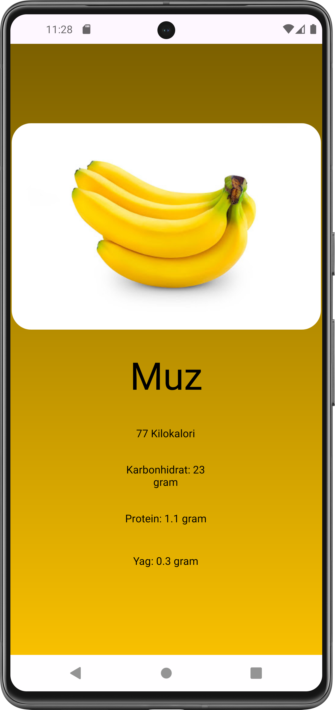

# Food Book 🍽️

A simple Kotlin-based app for displaying food details including nutritional information like calories, fats, proteins, etc.

## Screenshots

### Main Screen

<table>
  <tr>
    <td></td>
  </tr>
</table>

### Food Details Screen

<table>
  <tr>
    <td></td>
    <td></td>
  </tr>
</table>
